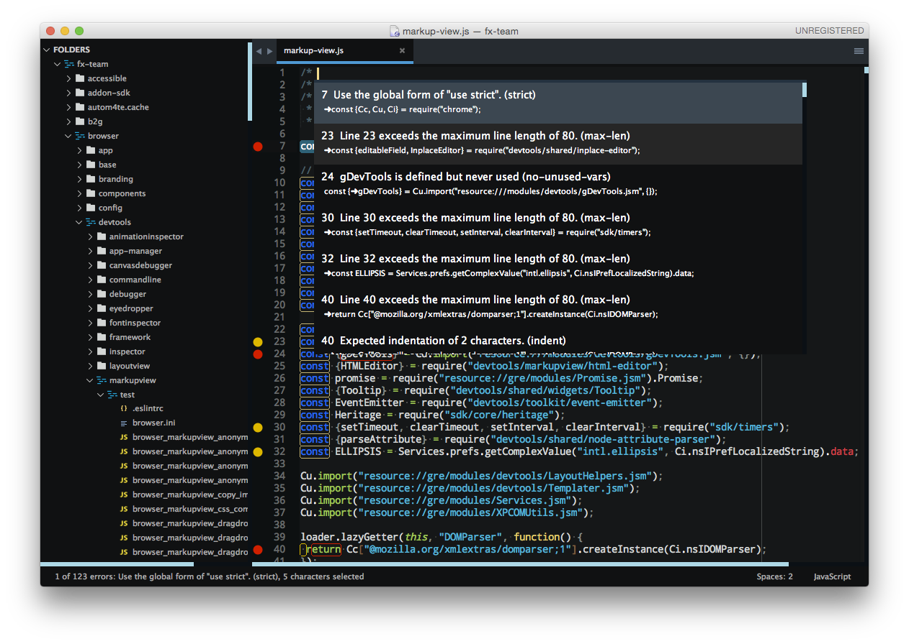
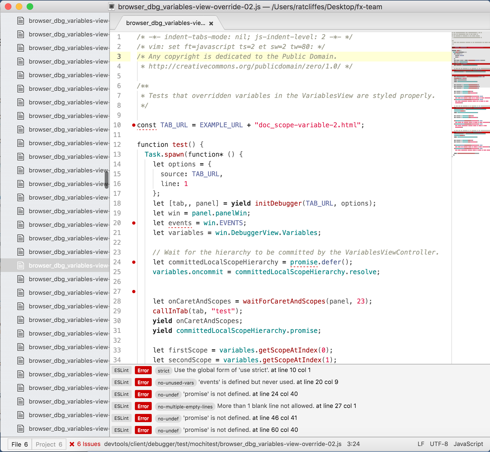
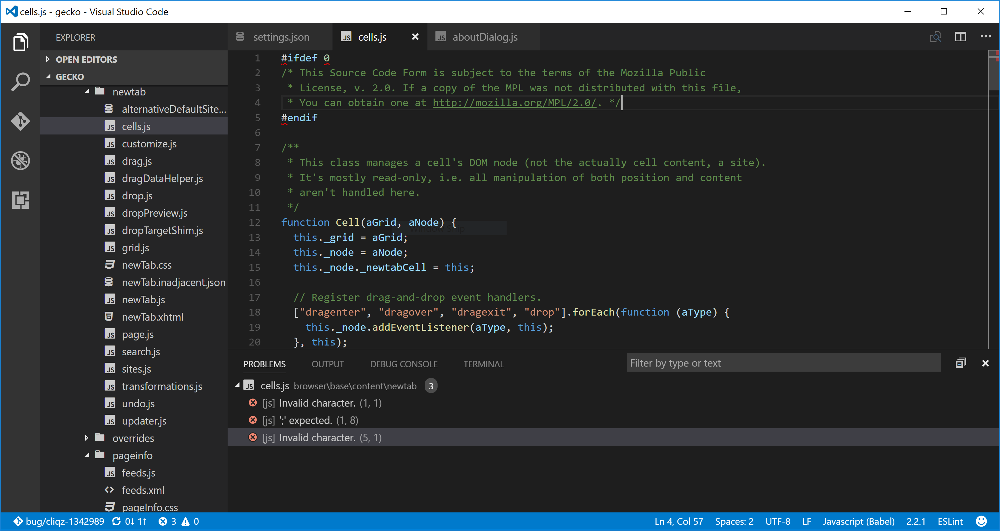

# Using ESLint in DevTools

The main rule set is in `devtools/.eslintrc`. It is meant to be used with ESLint 3.5.0.

Note that the file `.eslintignore` at the root of the repository contains a list of paths to ignore. This is because a lot of the code isn't ESLint compliant yet. We're in the process of making code free of ESLint warnings and errors, but this takes time. In the meantime, make sure the file or folder you are running ESLint on isn't ignored.

## Installing

From the root of the project type:

`./mach eslint --setup`

ESLint, `eslint-plugin-html`, `eslint-plugin-mozilla` and `eslint-plugin-react` will be automatically downloaded and installed.

## Running ESLint

### From the command line

The preferred way of running ESLint from the command line is by using `mach` like this:

```bash
./mach eslint path/to/directory
```

This makes sure that ESLint runs with the same configuration that on our CI environment (see the next section).

### In continuous integration

Relying only on people to run ESLint isn't enough to guarantee new warnings or errors aren't introduced in the code. Therefore, ESLint also runs automatically in our Continuous Integration environment.

This means that every time a commit is pushed to one of the repositories, a job runs ESLint on the whole code.

If you are pushing a patch to the [`try` repository](https://wiki.mozilla.org/ReleaseEngineering/TryServer) to run the tests, then you can also tell it to run the ESLint job and therefore verify that you did not introduce new errors.

If you build on all platforms, then the ESLint job will run by default, but if you selected a few platforms only in your  [trysyntax](https://wiki.mozilla.org/Build:TryChooser), then you need to also add `eslint-gecko` as a target platform for ESLint to run.

### Running ESLint in SublimeText

SublimeText is a popular code editor and it supports ESLint via a couple of plugins. Here are some pointers to get started:

* make sure you have [SublimeText 3](http://www.sublimetext.com/3), the linter plugin doesn't work with ST2,
* install [SublimeLinter 3](http://www.sublimelinter.com/en/latest/installation.html), this is a framework for linters that supports, among others, ESLint. Installing SublimeLinter via [Package Control](https://packagecontrol.io/installation) is the easiest way)
* with SublimeLinter installed, you can now [install the specific ESLint plugin](https://github.com/roadhump/SublimeLinter-eslint#linter-installation). The installation instructions provide details about how to install node, npm, eslint which are required).
* make sure to configure SublimeLinter with the `--no-ignore` option so that errors are also shown for source files that are ignored. To do this, open the SublimeLinter user configuration at: Preferences / Package Settings / SublimeLinter / Settings - User, and add `"args": "--no-ignore"` to the eslint linter object.

You will also need to point SublimeLinter at the local eslint installation by setting the path to whatever `./mach eslint --setup` gives you when you run it (include a trailing slash but remove the eslint binary filename) e.g.

NOTE: Your local eslint binary is at /some-project-path/tools/lint/eslint/node_modules/.bin/eslint

```
    "paths": {
        "linux": [],
        "osx": [
            "/some-project-path/tools/lint/eslint/node_modules/.bin"
        ],
        "windows": [
            "C:\\some-project-path\\tools\\lint\\eslint\\node_modules\\.bin"
        ]
    },
```

Once done, open the mozilla project in SublimeText and open any JS file in the `/devtools` directory. You can then trigger the linter via the contextual menu (right click on the file itself) or with a keyboard shortcut (ctrl+option+L on Mac).

You should see errors and warnings in the gutter as shown in the screenshot below. You can also see all errors listed with ctrl+option+A, and individual errors by clicking in the gutter marker.



### Running ESLint in Emacs

* First, install the flycheck package (flymake doesn't support ESLint yet).  You can get flycheck from the [marmalade](https://marmalade-repo.org/) or [melpa-stable](http://stable.melpa.org/#/) repositories.

* Tell flycheck to disable jslint, and enable flycheck in your javascript mode.  Some care is needed to find the eslint installed in the source tree.  This snippet assumes the built-in javascript mode, but with minor changes (just the name of the hook) should work fine with js2-mode as well:
```lisp
(defun my-js-mode-hacks ()
  (setq-local mode-name "JS")
  ;; Set this locally so that the head.js rule continues to work
  ;; properly.  In particular for a mochitest we want to preserve the
  ;; "browser_" prefix.
  (when (buffer-file-name)
    (let ((base (file-name-nondirectory (buffer-file-name))))
      (when (string-match "^\\([a-z]+_\\)" base)
	(setq-local flycheck-temp-prefix (match-string 1 base))))
    (let ((base-dir (locate-dominating-file (buffer-file-name)
					    ".eslintignore")))
      (when base-dir
	(let ((eslint (expand-file-name
		       "tools/lint/eslint/node_modules/.bin/eslint" base-dir)))
	  (when (file-exists-p eslint)
	    (setq-local flycheck-javascript-eslint-executable eslint))))))
  (flycheck-mode 1))
(require 'flycheck)
(setq-default flycheck-disabled-checkers
	      (append flycheck-disabled-checkers
		      '(javascript-jshint)))
(add-hook 'js-mode-hook #'my-js-mode-hacks)
```

* flycheck puts its bindings on `C-c !` by default, so use `C-c ! C-h` to see what is available.  There are key bindings to list all the errors and to move through the errors, among other things.
* To make sure flycheck is finding eslint, open a .js file and run `M-x flycheck-verify-setup`. It should show the path to your eslint installation.

### Running ESLint in Atom

From the root of the project type:

`./mach eslint --setup`

Install the [linter-eslint](https://atom.io/packages/linter-eslint) package v.8.00 or above. Then go to the package settings and enable the following options:


Once done, you should see errors and warnings as shown in the screenshot below.



### Running ESLint in ViM

If you don't use Syntastic yet, the instructions here should get you started: https://wiki.mozilla.org/WebExtensions/Hacking#Vim

Alternatively, if you do use Syntastic already, add this to your `.vimrc` to get ESLint working where the path contains `mozilla-central` (adjust the path to reflect the one in your computer):

```vim
 autocmd FileType javascript,html
    \ if stridx(expand("%:p"), "/mozilla-central/") != -1 |
    \    let b:syntastic_checkers = ['eslint'] |
    \    let b:syntastic_eslint_exec = '/path/to/mozilla-central/tools/lint/eslint/node_modules/.bin/eslint' |
    \    let b:syntastic_html_eslint_args = ['--plugin', 'html'] |
    \ endif
```

You probably need to close and reopen ViM for the changes to take effect. Then, open any file and try to edit it to cause an error, then save it. If all goes well, you will get some distinctive arrows pointing to the error. Hovering with the mouse will produce a sort of tooltip with more information about the error.

### Running ESLint in Visual Studio Code

From the root of the project type:

`./mach eslint --setup`

Install the [dbaeumer.vscode-eslint](https://marketplace.visualstudio.com/items?itemName=dbaeumer.vscode-eslint) package. Then go to the package settings and set the following option:

`"eslint.nodePath": "tools/lint/eslint/node_modules/.bin"`

Once done, you should see errors and warnings as shown in the screenshot below:



### Fixing ESLint Errors

Here is a list of advice for people writing new code that, hopefully, will help with writing eslint-clean code:

* When moving or refactoring a piece of code, consider this as an opportunity to remove all ESlint errors from this piece of code. In fact, it may even be a good opportunity to remove all ESLint errors from the entire file.
* When doing ESLint-only changes, please do them in a separate patch from the actual functionality changes or bug fix. This helps make the review easier, and isolate the actual changes when looking at the source history.
* When cleaning an entire file or folder from ESLint errors, do not forget to remove the corresponding entry from the `.eslintignore` file.
* When writing new code, from scratch, please make it ESLint compliant from the start. This is a lot easier than having to revisit it later.
* ESLint also runs on `<script>` tags in HTML files, so if you create new HTML test files for mochitests for example, make sure that JavaScript code in those files is free of ESLint errors.
* Depending on how a dependency is loaded into a file, the symbols this dependency exports might not be considered as defined by ESLint. For instance, using `Cu.import("some.jsm")` doesn't explicitly say which symbols are now available in the scope of the file, and so using those symbols will be consider by ESLint as using undefined variables. When this happens, please avoid using the `/* globals ... */` ESLint comment (which tells it that these variables are defined). Instead, please use `/* import-globals-from relative/path/to/file.js */`. This way, you won't have a list of variables to maintain manually, the globals are going to be imported dynamically instead.
* In test files (xpcshell and mochitest), all globals from the corresponding `head.js` file are imported automatically, so you don't need to define them using a `/* globals ... */` comment or a `/* import-globals-from head.js */` comment.

